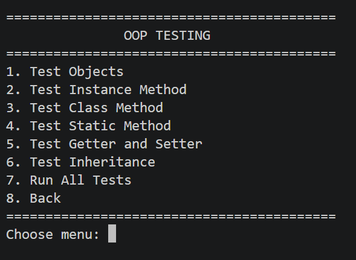
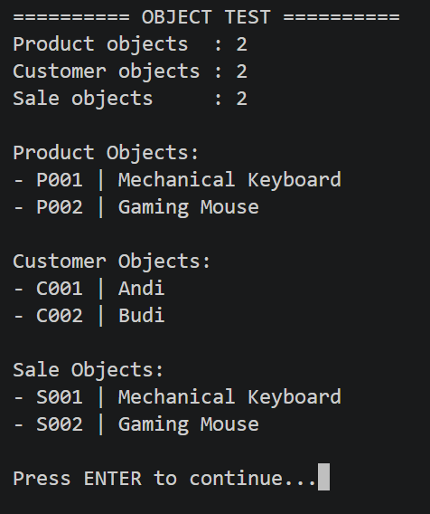
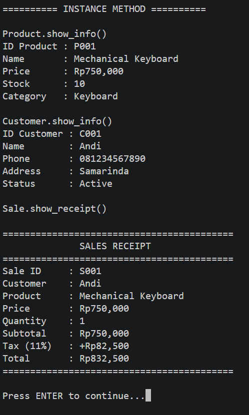
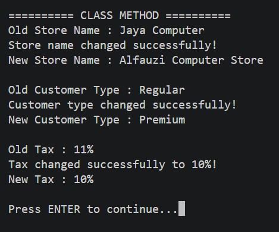
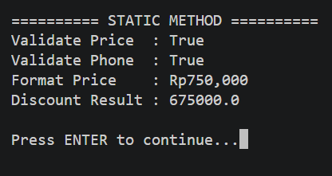
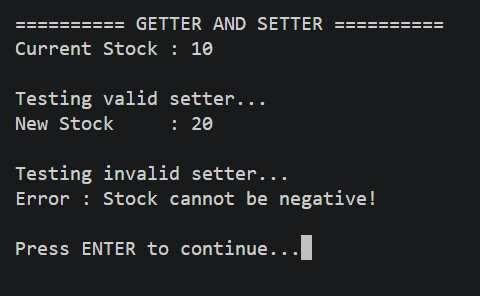
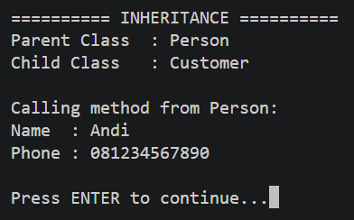
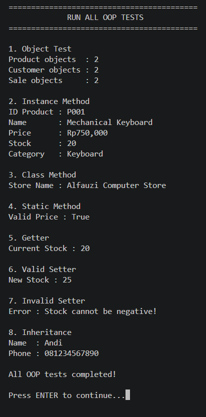
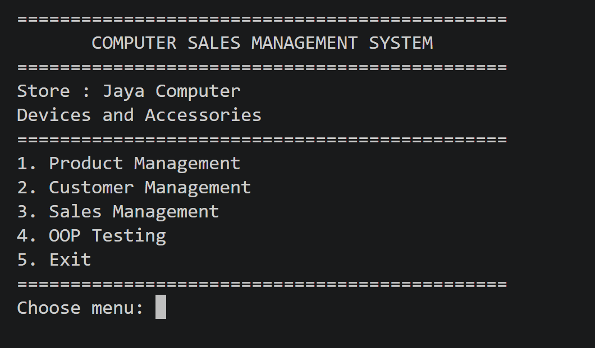

# Sistem Manajemen Penjualan Perangkat dan Aksesori Komputer

> **Nama:** Muhammad Alfauzi Syahputra  
> **Mata Kuliah:** Pemrograman Berorientasi Objek  
> **Bahasa Pemrograman:** Python

---

## Daftar Isi

1. [Deskripsi Proyek](#deskripsi-proyek)
2. [Struktur Proyek](#struktur-proyek)
3. [Arsitektur dan Desain OOP](#arsitektur-dan-desain-oop)
4. [Penjelasan Kelas](#penjelasan-kelas)
5. [Fitur Aplikasi](#fitur-aplikasi)
6. [Alur Program](#alur-program)
7. [Cara Menjalankan](#cara-menjalankan)
8. [Pengujian OOP](#pengujian-oop)
9. [Implementasi Kode Pengujian](#implementasi-kode-pengujian)
10. [Contoh Penggunaan](#contoh-penggunaan)
11. [Kesimpulan](#kesimpulan)

---

## Deskripsi Proyek

**Sistem Manajemen Penjualan Perangkat dan Aksesori Komputer** adalah aplikasi berbasis Command Line Interface (CLI) yang dibangun menggunakan Python. Aplikasi ini digunakan untuk mengelola data produk, pelanggan, stok, dan transaksi penjualan.

Fitur utama aplikasi meliputi:

- Menampilkan dan mengelola data produk.
- Menambah serta mengurangi stok produk.
- Mengelola data pelanggan.
- Mengubah alamat dan status pelanggan.
- Membuat transaksi penjualan.
- Menghitung total transaksi dan menampilkan struk.
- Mendemonstrasikan konsep-konsep Object-Oriented Programming (OOP).

Konsep OOP yang diterapkan adalah:

- Class dan object.
- Class attribute dan instance attribute.
- Public dan private attribute.
- Instance method, class method, dan static method.
- Encapsulation, getter, dan setter.
- Data validation.
- Inheritance.
- Package dan modularization.

---

## Struktur Proyek

```text
posttest1/
│
├── main.py                         # File utama program
├── requirements.txt                # Library yang digunakan
├── README.md                       # Dokumentasi proyek
│
├── assets/                         # Screenshot hasil program
│   ├── main_menu.png
│   ├── menu_test.png
│   ├── object_test.png
│   ├── instance_test.png
│   ├── class_method_test.png
│   ├── static_method_test.png
│   ├── getterandsetter_test.png
│   ├── inheritance_test.png
│   └── all_test.png
│
├── models/
│   ├── __init__.py
│   ├── person.py                   # Parent class Person
│   ├── customer.py                 # Class Customer
│   ├── product.py                  # Class Product
│   └── sale.py                     # Class Sale
│
├── menus/
│   ├── __init__.py
│   ├── product_menu.py             # Menu Product Management
│   ├── customer_menu.py            # Menu Customer Management
│   ├── sale_menu.py                # Menu Sales Management
│   └── testing_menu.py             # Menu OOP Testing
│
└── utils/
    ├── __init__.py
    └── helper.py                   # Helper functions
```

---

## Arsitektur dan Desain OOP

Hubungan antarclass dalam aplikasi:

```text
                 Person
                    │
                    │ inheritance
                    ▼
                Customer

                Product

                  Sale
             /             \
            ▼               ▼
       Customer          Product
```

`Customer` merupakan turunan dari `Person`, sedangkan `Sale` menggunakan object `Customer` dan `Product` untuk membentuk transaksi penjualan.

### Encapsulation

Atribut yang perlu dilindungi disimpan sebagai private attribute menggunakan double underscore, contohnya:

```python
self.__stock = stock
```

Atribut tersebut diakses melalui property:

```python
@property
def stock(self):
    return self.__stock

@stock.setter
def stock(self, new_stock):
    if new_stock < 0:
        raise ValueError("Stock cannot be negative!")
    self.__stock = new_stock
```

Dengan demikian, stok tidak dapat diubah menjadi nilai negatif.

### Inheritance

Inheritance diterapkan pada class `Customer`:

```python
class Customer(Person):
    def __init__(self, id_customer, name, phone, address, status):
        super().__init__(name, phone)
```

Dengan inheritance, `Customer` dapat menggunakan attribute dan method yang berasal dari `Person`, termasuk `show_person_info()`.

### Modularization

Kode dipisahkan berdasarkan tanggung jawabnya:

- `models` berisi class dan data aplikasi.
- `menus` berisi menu serta interaksi dengan pengguna.
- `utils` berisi helper function.
- `main.py` menjadi entry point aplikasi.

---

## Penjelasan Kelas

### 1. `Person`

`Person` adalah parent class untuk `Customer`.

| Attribute | Type | Keterangan |
|---|---|---|
| `__name` | String | Nama person |
| `phone` | String | Nomor telepon |

Method utama:

```python
def show_person_info(self):
    ...
```

Property `name` digunakan sebagai getter untuk private attribute `__name`.

### 2. `Customer`

`Customer` digunakan untuk menyimpan data pelanggan dan merupakan child class dari `Person`.

| Attribute | Type | Keterangan |
|---|---|---|
| `id_customer` | String | ID unik customer |
| `name` | String | Nama customer |
| `phone` | String | Nomor telepon |
| `address` | String | Alamat customer |
| `__status` | String | Status customer |

Class attribute yang digunakan antara lain `total_customers`, `customer_type`, dan `application_name`.

Method penting:

- `show_info()` untuk menampilkan data customer.
- `change_address()` untuk mengubah alamat dengan validasi.
- `change_status()` untuk mengubah status customer.
- `change_customer_type()` sebagai class method.
- `validate_phone()` sebagai static method.

### 3. `Product`

`Product` digunakan untuk menyimpan data perangkat dan aksesori komputer.

| Attribute | Type | Keterangan |
|---|---|---|
| `id_product` | String | ID unik produk |
| `name` | String | Nama produk |
| `price` | int | Harga produk |
| `category` | String | Kategori produk |
| `__stock` | int | Jumlah stok |

Class attribute yang digunakan adalah `store_name`, `store_category`, dan `total_products`.

Method penting:

- `show_info()` untuk menampilkan data produk.
- `add_stock()` untuk menambah stok.
- `reduce_stock()` untuk mengurangi stok.
- `change_store_name()` sebagai class method.
- `validate_price()` dan `format_price()` sebagai static method.
- Property `stock` sebagai getter dan setter.

### 4. `Sale`

`Sale` digunakan untuk mengelola transaksi penjualan.

| Attribute | Type | Keterangan |
|---|---|---|
| `id_sale` | String | ID transaksi |
| `customer` | Customer | Object customer |
| `product` | Product | Object product |
| `quantity` | int | Jumlah produk |
| `__total` | int | Total transaksi |

Method penting:

- `calculate_total()` menghitung harga produk dikalikan jumlah pembelian.
- `process_sale()` memproses transaksi dan mengurangi stok.
- `show_receipt()` menampilkan struk transaksi.
- `change_tax()` sebagai class method.
- `calculate_discount()` sebagai static method.

---

## Fitur Aplikasi

| No | Fitur | Keterangan |
|---:|---|---|
| 1 | Product Management | Mengelola data dan stok produk |
| 2 | Show Products | Menampilkan daftar produk |
| 3 | Add Stock | Menambahkan stok produk |
| 4 | Reduce Stock | Mengurangi stok produk |
| 5 | Customer Management | Mengelola data customer |
| 6 | Change Address | Mengubah alamat customer |
| 7 | Change Status | Mengubah status customer |
| 8 | Sales Management | Mengelola transaksi penjualan |
| 9 | Create Sale | Membuat transaksi baru |
| 10 | Show Sales | Menampilkan transaksi |
| 11 | Sales Receipt | Menampilkan struk transaksi |
| 12 | OOP Testing | Menguji konsep OOP |
| 13 | Exit | Mengakhiri program |

---

## Alur Program

```text
[Start]
    |
    v
[Main Menu]
    |
    ├── [1] Product Management
    │       ├── Show Products
    │       ├── Add Stock
    │       ├── Reduce Stock
    │       ├── Change Store Name
    │       └── Back
    │
    ├── [2] Customer Management
    │       ├── Show Customers
    │       ├── Change Address
    │       ├── Change Status
    │       ├── Change Customer Type
    │       └── Back
    │
    ├── [3] Sales Management
    │       ├── Create Sale
    │       ├── Show Sales
    │       ├── Change Tax
    │       └── Back
    │
    ├── [4] OOP Testing
    │       ├── Test Objects
    │       ├── Test Instance Method
    │       ├── Test Class Method
    │       ├── Test Static Method
    │       ├── Test Getter and Setter
    │       ├── Test Inheritance
    │       └── Run All Tests
    │
    └── [5] Exit
```

---

## Cara Menjalankan

### Prasyarat

- Python 3 telah terinstal.
- `pip` tersedia.
- Terminal atau Command Prompt dapat digunakan.

Cek versi Python:

```bash
python --version
```

### Instalasi Library

Masuk ke folder `posttest1`, kemudian jalankan:

```bash
pip install -r requirements.txt
```

Atau:

```bash
pip install tabulate
```

### Menjalankan Program

```bash
python main.py
```

---

## Pengujian OOP

Pilih menu **4. OOP Testing** pada Main Menu.

```text
==========================================
               OOP TESTING
==========================================
1. Test Objects
2. Test Instance Method
3. Test Class Method
4. Test Static Method
5. Test Getter and Setter
6. Test Inheritance
7. Run All Tests
8. Back
==========================================
```

Screenshot menu pengujian:



### 1. Test Objects

Menguji object yang telah dibuat dan menampilkan jumlah object dari setiap class.



### 2. Test Instance Method

Menguji method yang menggunakan parameter `self`, seperti `show_info()` dan `show_receipt()`.



### 3. Test Class Method

Menguji method dengan decorator `@classmethod`, seperti perubahan nama store, tipe customer, dan tax.



### 4. Test Static Method

Menguji method dengan decorator `@staticmethod`, seperti validasi harga, validasi nomor telepon, format harga, dan perhitungan diskon.



### 5. Test Getter and Setter

Menguji getter dan setter pada private attribute `__stock`. Nilai negatif ditolak menggunakan `ValueError`.



### 6. Test Inheritance

Menguji pewarisan antara `Person` dan `Customer`, termasuk pemanggilan method `show_person_info()` dari parent class.



### 7. Run All Tests

Menjalankan seluruh pengujian OOP dalam satu eksekusi.



---

## Implementasi Kode Pengujian

Kode menu pengujian berada di `menus/testing_menu.py`.

### Struktur Menu Testing

```python
from utils import clear_screen, pause


def testing_menu(products, customers, sales, Product, Customer, Sale):
    """Menu untuk menguji konsep OOP."""
    while True:
        clear_screen()
        print("==========================================")
        print("               OOP TESTING")
        print("==========================================")
        print("1. Test Objects")
        print("2. Test Instance Method")
        print("3. Test Class Method")
        print("4. Test Static Method")
        print("5. Test Getter and Setter")
        print("6. Test Inheritance")
        print("7. Run All Tests")
        print("8. Back")
        print("==========================================")

        choice = input("Choose menu: ")

        if choice == "1":
            test_objects(products, customers, sales)
        elif choice == "2":
            test_instance_method(products, customers, sales)
        elif choice == "3":
            test_class_method(Product, Customer, Sale)
        elif choice == "4":
            test_static_method(Product, Customer, Sale)
        elif choice == "5":
            test_getter_setter(products)
        elif choice == "6":
            test_inheritance(customers)
        elif choice == "7":
            run_all_tests(products, customers, sales, Product, Customer, Sale)
        elif choice == "8":
            break
        else:
            print("Invalid choice!")
            pause()
```

### Test Objects

```python
def test_objects(products, customers, sales):
    """Menampilkan object yang telah dibuat."""
    clear_screen()
    print("========== OBJECT TEST ==========")
    print(f"Product objects  : {len(products)}")
    print(f"Customer objects : {len(customers)}")
    print(f"Sale objects     : {len(sales)}")

    print("\\nProduct Objects:")
    for product in products:
        print(f"- {product.id_product} | {product.name}")

    print("\\nCustomer Objects:")
    for customer in customers:
        print(f"- {customer.id_customer} | {customer.name}")

    print("\\nSale Objects:")
    for sale in sales:
        print(f"- {sale.id_sale} | {sale.product.name}")

    pause()
```

Pengujian ini membuktikan bahwa object dari `Product`, `Customer`, dan `Sale` berhasil dibuat.

### Test Instance Method

```python
def test_instance_method(products, customers, sales):
    """Menguji instance method."""
    clear_screen()
    print("========== INSTANCE METHOD ==========")

    print("\\nProduct.show_info()")
    products[0].show_info()

    print("\\nCustomer.show_info()")
    customers[0].show_info()

    print("\\nSale.show_receipt()")
    sales[0].show_receipt()

    pause()
```

Method dipanggil melalui object dan dapat mengakses attribute instance menggunakan `self`.

### Test Class Method

```python
def test_class_method(Product, Customer, Sale):
    """Menguji class method."""
    clear_screen()
    print("========== CLASS METHOD ==========")

    print(f"Old Store Name : {Product.store_name}")
    Product.change_store_name("Alfauzi Computer Store")
    print(f"New Store Name : {Product.store_name}")

    print(f"\\nOld Customer Type : {Customer.customer_type}")
    Customer.change_customer_type("Premium")
    print(f"New Customer Type : {Customer.customer_type}")

    print(f"\\nOld Tax : {Sale.tax}%")
    Sale.change_tax(10)
    print(f"New Tax : {Sale.tax}%")

    pause()
```

Class method menggunakan `@classmethod`, menerima parameter `cls`, dan dapat mengubah class attribute.

### Test Static Method

```python
def test_static_method(Product, Customer, Sale):
    """Menguji static method."""
    clear_screen()
    print("========== STATIC METHOD ==========")
    print("Validate Price  :", Product.validate_price(500000))
    print("Validate Phone  :", Customer.validate_phone("081234567890"))
    print("Format Price    :", Product.format_price(750000))
    print("Discount Result :", Sale.calculate_discount(750000, 10))
    pause()
```

Static method tidak menggunakan `self` maupun `cls` dan dapat dipanggil melalui nama class.

### Test Getter dan Setter

```python
def test_getter_setter(products):
    """Menguji getter dan setter."""
    clear_screen()
    print("========== GETTER AND SETTER ==========")

    product = products[0]
    print(f"Current Stock : {product.stock}")

    print("\\nTesting valid setter...")
    try:
        product.stock = 20
        print(f"New Stock     : {product.stock}")
    except ValueError as error:
        print(error)

    print("\\nTesting invalid setter...")
    try:
        product.stock = -10
    except ValueError as error:
        print(f"Error : {error}")

    pause()
```

Pengujian ini membuktikan penggunaan `@property`, setter, encapsulation, serta validasi data.

### Test Inheritance

```python
def test_inheritance(customers):
    """Menguji inheritance."""
    clear_screen()
    print("========== INHERITANCE ==========")

    customer = customers[0]
    print("Parent Class  : Person")
    print("Child Class   : Customer")
    print("\\nCalling method from Person:")
    customer.show_person_info()

    pause()
```

Method `show_person_info()` berasal dari class `Person` dan dapat digunakan oleh object `Customer` karena inheritance.

### Run All Tests

```python
def run_all_tests(products, customers, sales, Product, Customer, Sale):
    """Menjalankan seluruh pengujian OOP."""
    clear_screen()
    print("==========================================")
    print("             RUN ALL OOP TESTS")
    print("==========================================")

    print("\\n1. Object Test")
    print(f"Product objects  : {len(products)}")
    print(f"Customer objects : {len(customers)}")
    print(f"Sale objects     : {len(sales)}")

    print("\\n2. Instance Method")
    products[0].show_info()

    print("\\n3. Class Method")
    print(f"Store Name : {Product.store_name}")

    print("\\n4. Static Method")
    print(f"Valid Price : {Product.validate_price(500000)}")

    print("\\n5. Getter")
    print(f"Current Stock : {products[0].stock}")

    print("\\n6. Valid Setter")
    products[0].stock = 25
    print(f"New Stock : {products[0].stock}")

    print("\\n7. Invalid Setter")
    try:
        products[0].stock = -5
    except ValueError as error:
        print(f"Error : {error}")

    print("\\n8. Inheritance")
    customers[0].show_person_info()

    print("\\nAll OOP tests completed!")
    pause()
```

---

## Contoh Penggunaan

### Main Menu



```text
==============================================
       COMPUTER SALES MANAGEMENT SYSTEM
==============================================
Store : Alfauzi Computer
Devices and Accessories
==============================================
1. Product Management
2. Customer Management
3. Sales Management
4. OOP Testing
5. Exit
==============================================
Choose menu:
```

### Product Management

```text
==========================================
          PRODUCT MANAGEMENT
==========================================
1. Show Products
2. Add Stock
3. Reduce Stock
4. Change Store Name
5. Back
==========================================
Choose menu: 1
```

Contoh output:

```text
ID Product  Name                  Price       Stock  Category
----------------------------------------------------------------
P001        Mechanical Keyboard   Rp750,000   10     Keyboard
P002        Gaming Mouse          Rp350,000   15     Mouse
```

### Customer Management

```text
ID Customer  Name   Phone          Address      Status
---------------------------------------------------------
C001         Andi   081234567890   Samarinda    Active
C002         Budi   082345678901   Balikpapan   Active
```

### Sales Management

```text
Customer ID : C001
Product ID  : P001
Quantity    : 1

Sale processed successfully!
```

Contoh sales receipt:

```text
==========================================
              SALES RECEIPT
==========================================
Sale ID     : S003
Customer    : Andi
Product     : Mechanical Keyboard
Price       : Rp750,000
Quantity    : 1
Total       : Rp750,000
==========================================
```

---

## Kesimpulan

**Sistem Manajemen Penjualan Perangkat dan Aksesori Komputer** merupakan aplikasi Python berbasis CLI yang menerapkan konsep OOP untuk mengelola produk, customer, stok, dan transaksi penjualan.

Program ini telah menerapkan **class dan object, attribute, method, encapsulation, getter dan setter, validation, inheritance, class method, static method, serta modularization**. Selain itu, tersedia **OOP Testing Menu** yang menampilkan bukti implementasi dan pengujian setiap konsep tersebut.
