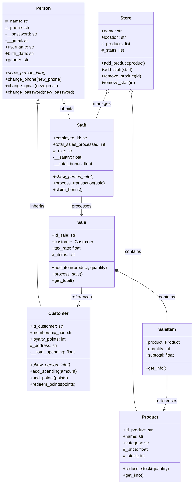
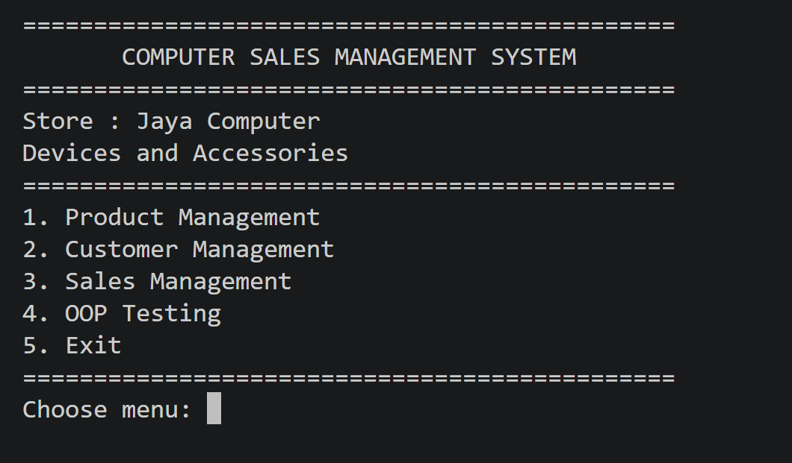

# Sistem Manajemen Penjualan Perangkat dan Aksesori Komputer

> **Nama:** Muhammad Alfauzi Syahputra
> **Mata Kuliah:** Pemrograman Berorientasi Objek (OOP)
> **Bahasa Pemrograman:** Python 3
> **Tugas:** Posttest 2 — Relasi UML & Inheritance

---

## Daftar Isi

1. [Deskripsi Proyek](#deskripsi-proyek)
2. [Struktur Proyek](#struktur-proyek)
3. [Diagram Kelas (UML)](#diagram-kelas-uml)
4. [Relasi UML](#1-relasi-uml)
5. [Inheritance](#2-inheritance)
6. [Cara Menjalankan Program](#cara-menjalankan-program)
7. [Skenario Pengujian OOP](#skenario-pengujian-oop)
8. [Screenshot Program](#screenshot-program)
9. [Kesimpulan](#kesimpulan)

---

## Deskripsi Proyek

Aplikasi berbasis Command Line Interface (CLI) untuk mensimulasikan sistem kasir dan manajemen toko komputer. Fitur utamanya: login/register dengan peran **Staff** dan **Customer**, manajemen produk, penjualan, dan laporan transaksi. Program mendemonstrasikan konsep OOP: inheritance (superclass Person), encapsulation (private/protected), serta relasi UML (asosiasi, agregasi, dan komposisi).

---

## Struktur Proyek

```text
posttest2/
├── main.py
├── README.md
├── requirements.txt
├── .gitignore
├── models/
│   ├── __init__.py
│   ├── person.py        # Superclass
│   ├── customer.py      # Subclass
│   ├── staff.py         # Subclass
│   ├── product.py
│   ├── store.py
│   ├── sale.py
│   └── sale_item.py
├── menus/
│   ├── __init__.py
│   ├── auth.py
│   ├── staff_dashboard.py
│   ├── customer_dashboard.py
│   ├── customer_menu.py
│   ├── product_menu.py
│   ├── sale_menu.py
│   └── testing_menu.py
└── utils/
    ├── __init__.py
    └── helper.py
```

---

## Diagram Kelas (UML)



**Keterangan Notasi:**
- `<|--` : Inheritance (Pewarisan)
- `o--` : Aggregation (Agregasi) - bagian dapat hidup mandiri
- `*--` : Composition (Komposisi) - bagian terikat pada keseluruhan
- `-->` : Association (Asosiasi) - hubungan antar objek

**Tingkat Akses:**
- `+` : Public
- `#` : Protected
- `-` : Private
- `*` : Abstract method

---

## 1. Relasi UML

| Relasi | Implementasi | Penjelasan |
|---|---|---|
| **Inheritance** | `Customer` extends `Person`, `Staff` extends `Person` | `Customer` dan `Staff` mewarisi atribut dan method dari `Person` (username, birth_date, gender, dll). Kedua class me-override method `show_person_info()` dengan menambahkan data spesifik mereka. |
| **Asosiasi** | `Staff` → `Sale`, `Sale` → `Customer`, `SaleItem` → `Product` | `Staff.process_transaction(sale)` menerima objek `Sale` sebagai parameter tanpa menyimpannya sebagai atribut. Hubungan bersifat sesaat (temporary). |
| **Agregasi** | `Store` o-- `Product` & `Staff` | Objek `Product` dan `Staff` dibuat **di luar** `Store`, kemudian didaftarkan lewat `add_product()` / `add_staff()`. Jika `Store` dihapus, objek tersebut tetap ada. |
| **Komposisi** | `Sale` *-- `SaleItem` | Objek `SaleItem` dibuat **di dalam** method `Sale.add_item()`. `SaleItem` tidak berdiri sendiri dan ikut hilang bersama `Sale` dihapus (siklus hidup terikat). |

### Potongan Kode Relasi:

```python
# ========== INHERITANCE ==========
class Customer(Person):
    def __init__(self, id_customer, name, username, password, phone, gmail, address, ...):
        super().__init__(name, username, password, phone, gmail, birth_date, gender)
        self.id_customer = id_customer
        self._address = address
        ...

# ========== AGREGASI (main.py) ==========
# Objek dibuat di luar, lalu dimasukkan ke Store
my_store = Store("Alfauzi Computer Store", "Samarinda")
prod1 = Product("P001", "Mechanical Keyboard", 750000, 10, "Peripheral")
my_store.add_product(prod1)

# ========== KOMPOSISI (models/sale.py) ==========
# SaleItem dibuat dan hidup di dalam Sale
def add_item(self, product, quantity):
    new_item = SaleItem(product, quantity)  # Dibuat di sini
    self._items.append(new_item)

# ========== ASOSIASI (models/staff.py) ==========
# Sale hanya diterima sebagai parameter, tidak disimpan
def process_transaction(self, sale):
    if sale.process_sale():
        self.total_sales_processed += 1
        # Sale tidak menjadi atribut Staff
```

---

## 2. Inheritance

### Superclass dan Subclass

- **Superclass:** `Person` (Kelas induk yang umum)
- **Subclass:** `Customer` dan `Staff` (Kelas turunan khusus)

### Pemanggilan `super().__init__()`

```python
class Customer(Person):
    def __init__(self, id_customer, name, username, password, phone, gmail, address, birth_date, gender):
        super().__init__(name, username, password, phone, gmail, birth_date, gender)
        self.id_customer = id_customer
        self._address = address
        self.membership_tier = "Bronze"
        self.loyalty_points = 0

class Staff(Person):
    def __init__(self, name, username, password, employee_id, role, salary, phone, gmail, birth_date, gender):
        super().__init__(name, username, password, phone, gmail, birth_date, gender)
        self.employee_id = employee_id
        self._role = role
        self.__salary = salary
        self.__total_bonus = 0
        self.total_sales_processed = 0
```

### Atribut Tambahan (Unik per Subclass)

| Kelas | Atribut Spesifik | Tipe |
|---|---|---|
| `Customer` | `id_customer`, `_address`, `membership_tier`, `loyalty_points`, `__total_spending` | str, str, str, int, float |
| `Staff` | `employee_id`, `_role`, `__salary`, `__total_bonus`, `total_sales_processed` | str, str, float, float, int |

### Method Overriding

Method `show_person_info()` dari `Person` di-override di `Customer` dan `Staff`. Kedua subclass memanggil versi parent dengan `super()`, kemudian menambahkan data unik masing-masing.

```python
# ========== PERSON (Superclass) ==========
def show_person_info(self):
    print(f"Name       : {self._name}")
    print(f"Username   : {self.username}")
    print(f"Gmail      : {self.gmail}")
    print(f"Gender     : {self.gender}")

# ========== CUSTOMER (Subclass) ==========
def show_person_info(self):
    super().show_person_info()  # Panggil versi Parent
    print(f"ID Customer    : {self.id_customer}")
    print(f"Membership     : {self.membership_tier}")
    print(f"Loyalty Points : {self.loyalty_points}")

# ========== STAFF (Subclass) ==========
def show_person_info(self):
    super().show_person_info()  # Panggil versi Parent
    print(f"Employee ID    : {self.employee_id}")
    print(f"Role           : {self._role}")
    print(f"Total Sales    : {self.total_sales_processed}")
```

### Protected dan Private pada Pewarisan

| Tingkat Akses | Atribut di `Person` | Alasan |
|---|---|---|
| **Protected** (`_nama`) | `_name`, `_phone` | Perlu diakses langsung oleh subclass, misalnya `Customer.add_points()` memakai `self._name` dan `Staff.show_person_info()` memakai `self._name`. |
| **Private** (`__nama`) | `__password`, `__gmail` | Data sensitif milik `Person`. Subclass hanya bisa mengaksesnya lewat property (`password`, `gmail`) atau method (`change_password()`, `change_gmail()`). Tidak ada akses langsung ke `__password` dari subclass. |

Validasi `phone` dan `gmail` ditulis **satu kali** di `Person` dan diwarisi oleh kedua subclass, sehingga menghindari duplikasi kode.

---

## Cara Menjalankan Program

```bash
pip install -r requirements.txt
python main.py
```

### Akun Default untuk Pengujian

- **Staff (Manager):** Username `admin` / Password `admin123`
- **Customer:** Username `rina_m` / Password `password1`

---

## Skenario Pengujian OOP

Pilih menu `3. OOP Testing` pada Main Menu untuk menjalankan pengujian fitur OOP:

| Menu | Yang Dibuktikan |
|---|---|
| 1. Test Inheritance | `show_person_info()` menampilkan data parent (Name, Username, Gmail) dan child (ID Customer, Membership Tier). |
| 2. Test Encapsulation | Setter `product.stock = -10` ditolak dengan `ValueError`. Atribut private terlindungi. |
| 3. Test Class Method | `Sale.change_tax(15)` mengubah tax rate untuk **semua** objek `Sale`. |
| 4. Test Static Method | `Product.validate_price(-500)` mengembalikan `False` tanpa membuat objek instance. |
| 5. Test Association | `Staff` memproses `Sale` lewat parameter, dan `hasattr(staff, 'sale')` bernilai `False`. |
| 6. Test Aggregation | `Store` dihapus dengan `del`, tetapi objek `Product` tetap ada di memori. |
| 7. Test Composition | `SaleItem` dibuat di dalam `Sale.add_item()` dan terikat pada `Sale`. |
| 8. Run All Tests | Menjalankan semua pengujian di atas secara berurutan. |

---

## Screenshot Program

> Tambahkan screenshot hasil run di sini (simpan gambar di folder `assets/`), contoh:
>
> ```
> 
> 
> 
> ```

---

## Kesimpulan

Program ini menerapkan tiga relasi UML (asosiasi, agregasi, komposisi) dan konsep inheritance lengkap:
- **Satu superclass** (`Person`) yang menyediakan template data dan method umum
- **Dua subclass** (`Customer`, `Staff`) yang memperluas fungsionalitas parent
- **Pemanggilan `super().__init__()`** untuk inisialisasi atribut parent
- **Method overriding** pada `show_person_info()` dengan tetap memanggil versi parent
- **Encapsulation** menggunakan protected (`_`) dan private (`__`) untuk melindungi data
- **Relasi UML** yang menunjukkan hubungan antar class sesuai prinsip OOP

Dengan struktur ini, kode lebih modular, terhindar dari duplikasi, dan mudah untuk di-maintenance serta pengembangan lebih lanjut.
