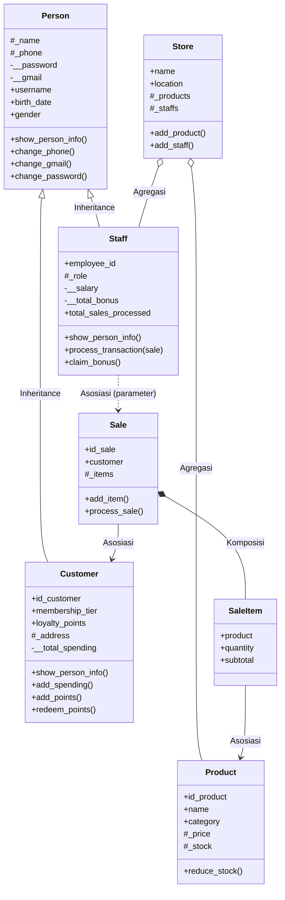

# Sistem Manajemen Penjualan Perangkat dan Aksesori Komputer

> **Nama:** Muhammad Alfauzi Syahputra
> **Mata Kuliah:** Pemrograman Berorientasi Objek (OOP)
> **Bahasa Pemrograman:** Python 3
> **Tugas:** Posttest 2 — Relasi UML & Inheritance

---

## Daftar Isi

1. [Deskripsi Proyek](#deskripsi-proyek)
2. [Struktur Proyek](#struktur-proyek)
3. [Diagram Kelas (UML)](#diagram-kelas-uml)
4. [Relasi UML](#1-relasi-uml)
5. [Inheritance](#2-inheritance)
6. [Cara Menjalankan Program](#cara-menjalankan-program)
7. [Skenario Pengujian OOP](#skenario-pengujian-oop)
8. [Screenshot Program](#screenshot-program)
9. [Kesimpulan](#kesimpulan)

---

## Deskripsi Proyek

Aplikasi berbasis Command Line Interface (CLI) untuk mensimulasikan sistem kasir dan manajemen toko komputer. Fitur utamanya: login/register dengan peran **Staff** dan **Customer**, manajemen produk dan stok, transaksi penjualan dengan diskon (berdasarkan tier membership) dan pajak, poin loyalitas, bonus karyawan, serta menu **OOP Testing** untuk membuktikan setiap konsep yang diminta soal.

---

## Struktur Proyek

```text
posttest2/
├── main.py
├── README.md
├── requirements.txt
├── .gitignore
├── models/
│   ├── __init__.py
│   ├── person.py        # Superclass
│   ├── customer.py      # Subclass
│   ├── staff.py         # Subclass
│   ├── product.py
│   ├── store.py
│   ├── sale.py
│   └── sale_item.py
├── menus/
│   ├── __init__.py
│   ├── auth.py
│   ├── staff_dashboard.py
│   ├── customer_dashboard.py
│   ├── customer_menu.py
│   ├── product_menu.py
│   ├── sale_menu.py
│   └── testing_menu.py
└── utils/
    ├── __init__.py
    └── helper.py
```

---

## Diagram Kelas (UML)



Keterangan notasi: `<|--` inheritance, `o--` agregasi, `*--` komposisi, `-->` dan `..>` asosiasi. Pada atribut: `+` public, `#` protected, `-` private.

---

## 1. Relasi UML

| Relasi | Implementasi | Penjelasan |
|---|---|---|
| **Asosiasi** | `Staff` → `Sale`, `Sale` → `Customer` | `Staff.process_transaction(sale)` menerima objek `Sale` sebagai parameter dan tidak menyimpannya sebagai atribut, sehingga hubungannya hanya sementara. `Sale` juga menyimpan referensi ke `Customer` yang melakukan pembelian. |
| **Agregasi** | `Store` ◇— `Product` & `Staff` | Objek `Product` dan `Staff` dibuat **di luar** `Store`, lalu didaftarkan lewat `add_product()` / `add_staff()`. Jika `Store` dihapus, objek tersebut tetap ada (siklus hidup mandiri). |
| **Komposisi** | `Sale` ◆— `SaleItem` | Objek `SaleItem` dibuat **di dalam** `Sale.add_item()`. `SaleItem` tidak berdiri sendiri dan ikut hilang bersama `Sale` (siklus hidup terikat). |

Potongan kode:

```python
# Agregasi (main.py): objek dibuat di luar, lalu dimasukkan ke Store
my_store = Store("Alfauzi Computer Store", "Samarinda")
prod1 = Product("P001", "Mechanical Keyboard", 750000, 10, "Peripheral")
my_store.add_product(prod1)

# Komposisi (models/sale.py): SaleItem dibuat di dalam Sale
new_item = SaleItem(product, quantity)
self._items.append(new_item)

# Asosiasi (models/staff.py): Sale hanya diterima sebagai parameter
def process_transaction(self, sale):
    if sale.process_sale():
        ...
```

---

## 2. Inheritance

### Superclass dan Subclass

- **Superclass:** `Person`
- **Subclass:** `Customer` dan `Staff`

### Pemanggilan `super().__init__()`

```python
class Customer(Person):
    def __init__(self, id_customer, name, username, password, phone, gmail, address, ...):
        super().__init__(name, username, password, phone, gmail, birth_date, gender)
        self.id_customer = id_customer
        ...

class Staff(Person):
    def __init__(self, name, username, password, employee_id, role, salary, phone, gmail, ...):
        super().__init__(name, username, password, phone, gmail, birth_date, gender)
        self.employee_id = employee_id
        ...
```

### Atribut Tambahan (unik per subclass)

| Kelas | Atribut spesifik |
|---|---|
| `Customer` | `id_customer`, `_address`, `membership_tier`, `loyalty_points`, `__total_spending` |
| `Staff` | `employee_id`, `_role`, `__salary`, `__total_bonus`, `total_sales_processed`, `is_active` |

### Method Overriding

Method `show_person_info()` milik `Person` di-override di `Customer` dan `Staff`. Keduanya memanggil versi parent dengan `super()`, lalu menambahkan data khas masing-masing.

```python
# Person: hanya data umum
def show_person_info(self):
    print(f"Name : {self._name}")
    ...

# Customer: data umum + data pelanggan
def show_person_info(self):
    super().show_person_info()
    print(f"ID Customer    : {self.id_customer}")
    print(f"Membership     : {self.membership_tier}")
    ...

# Staff: data umum + data karyawan
def show_person_info(self):
    super().show_person_info()
    print(f"Employee ID    : {self.employee_id}")
    print(f"Role           : {self._role}")
    ...
```

### Protected dan Private pada Pewarisan

| Tingkat akses | Atribut di `Person` | Alasan |
|---|---|---|
| **Protected** (`_nama`) | `_name`, `_phone` | Perlu diakses langsung oleh subclass, misalnya `Customer.add_points()` memakai `self._name` dan `Staff.deactivate()` memakai `self._name`. |
| **Private** (`__nama`) | `__password`, `__gmail` | Data sensitif milik `Person`. Subclass hanya bisa mengaksesnya lewat property (`password`, `gmail`) atau method `change_password()` / `change_gmail()`. |

Validasi `phone` dan `gmail` ditulis **satu kali** di `Person` dan diwarisi oleh kedua subclass, sehingga tidak ada kode duplikat.

---

## Cara Menjalankan Program

```bash
pip install -r requirements.txt
python main.py
```

Akun default untuk pengujian:

- Staff (Manager): `admin` / `admin123`
- Customer: `rina_m` / `password1`

---

## Skenario Pengujian OOP

Pilih menu `3. OOP Testing` pada Main Menu:

| Menu | Yang dibuktikan |
|---|---|
| 1. Test Inheritance | `show_person_info()` menampilkan data parent (Name, Username, Gmail) dan child (ID Customer, Membership). |
| 2. Test Encapsulation | `product.stock = -10` ditolak dengan `ValueError`. |
| 3. Test Class Method | `Sale.change_tax(15)` mengubah pajak untuk semua objek `Sale`. |
| 4. Test Static Method | `Product.validate_price(-500)` mengembalikan `False` tanpa membuat objek. |
| 5. Test Association | `Staff` memproses `Sale` lewat parameter, dan `hasattr(staff, 'sale')` bernilai `False`. |
| 6. Test Aggregation | `Store` dihapus dengan `del`, tetapi objek `Product` tetap ada. |
| 7. Test Composition | `SaleItem` dibuat di dalam `Sale.add_item()` dan terikat pada `Sale`. |
| 8. Run All Tests | Menjalankan semua pengujian di atas. |

---

## Screenshot Program

> Tambahkan screenshot hasil run di sini (simpan gambar di folder `assets/`), contoh:
>
> ``
> ``
> ``

---

## Kesimpulan

Program ini menerapkan tiga relasi UML (asosiasi, agregasi, komposisi) dan konsep inheritance lengkap: satu superclass (`Person`), dua subclass (`Customer`, `Staff`), pemanggilan `super().__init__()`, atribut unik per subclass, method overriding (`show_person_info()`), serta pembagian akses protected dan private sesuai kebutuhan pewarisan.
